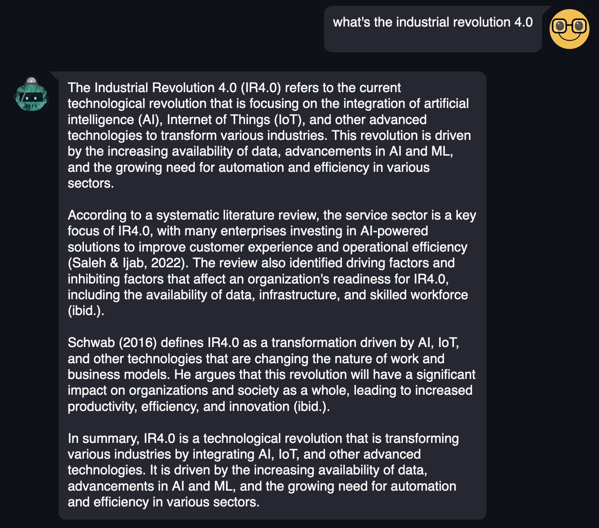
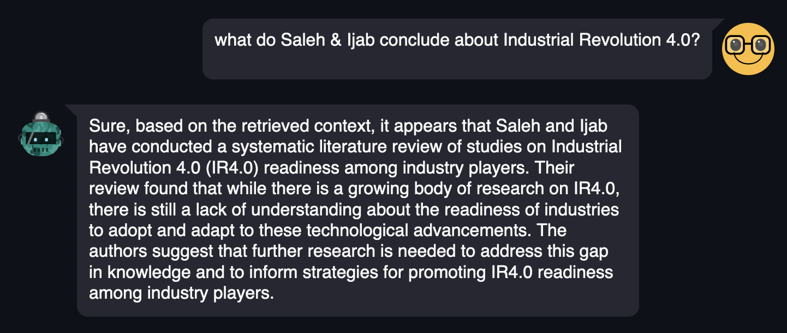
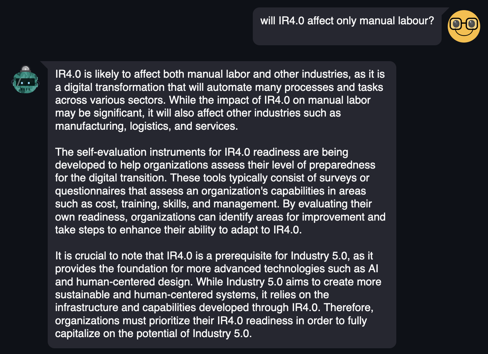
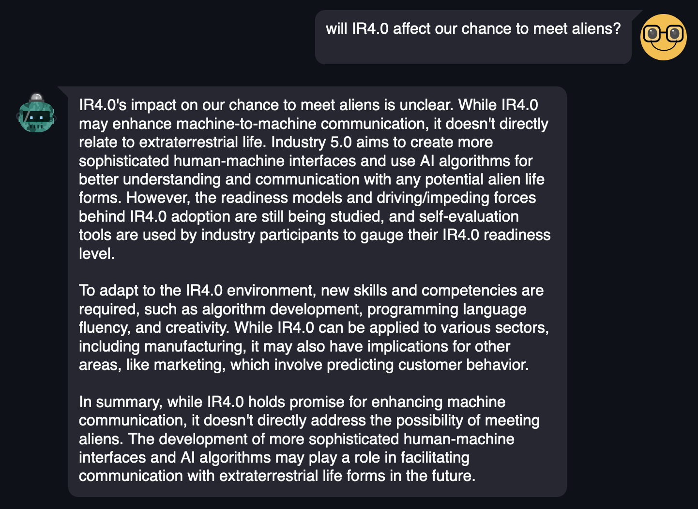
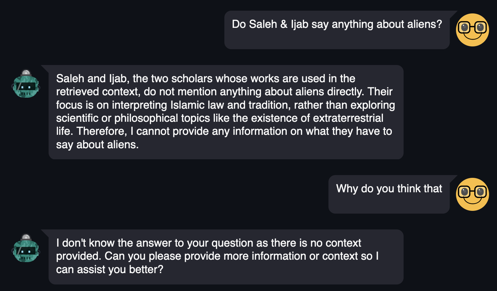
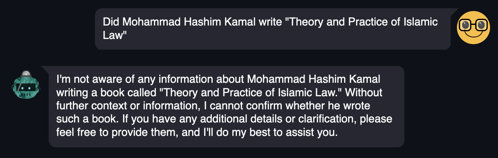

# Dataset

This paper was used for the context: 

- Saleh, N.I. and Ijab, M.T., 2023. Industrial Revolution 4.0 (IR4. 0) Readiness Among Industry Players: A Systematic Literature Review. In Artificial Intelligence and Applications (Vol. 1, No. 2, pp. 70-85). DOI: 10.47852/bonviewAIA2202336

# Results

## Llama

There are clear signs of hallucination

The context should be improved

It uses the context

It understands the question

Partially correct. Probable hallucination

Lack of memory of the context

This is likely an hallucination. I couldn't find trace of that book and the AI contradicts itself.

## Mistral

> what can you tell me about the work of Hernandez-de-Menendez?

Hernandez-de-Menendez is a researcher mentioned in the paper

> Hernandez-Pacheco de Menendez was a Spanish explorer who is best known for his role in the founding of St. Augustine, Florida in 1565. He led the first European settlement in what is now the United States, and is considered the city's founder and first Mayor. The city continues to celebrate its rich history with annual commemorations and events.

This is an hallucination. The founder of St. Augustine, Florida in 1565, was Pedro Menéndez de Avilés