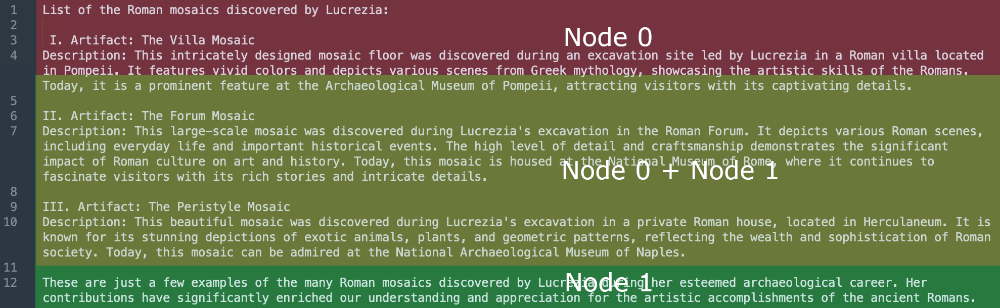
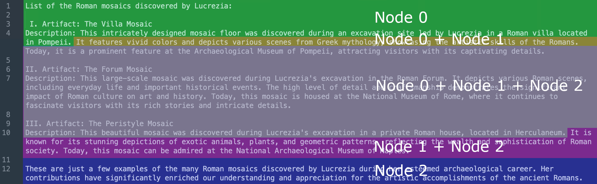
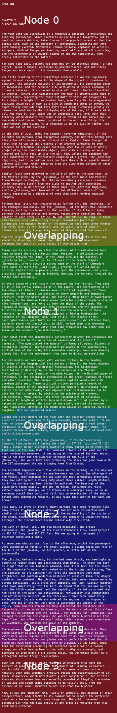

# Sentence-Split

Evaluates different configurations of SentenceSplitter

## Using `bio` as a base

### chunk size=317

317 is the largest size producing at least two nodes. However, node 0 contains node 1

### chunk size=300

300 produces two nodes with a large overlapping.



### chunk size=256

Three nodes



### chunk size=200

Most nodes are contained in other nodes.

For example:
- node 1 contains node 0
- node 2 contains nodes 0 and 1
- node 3 contains nodes 0, 1, and 2

### chunk size=128

Failed with error:

```
ValueError: Got a larger chunk overlap (200) than chunk size (128), should be smaller.
```

## Using Twenty Thousand Leagues under the Sea by Jules Verne

## chunk size=1024

The nodes partially overlap and share a couple of paragraph.

