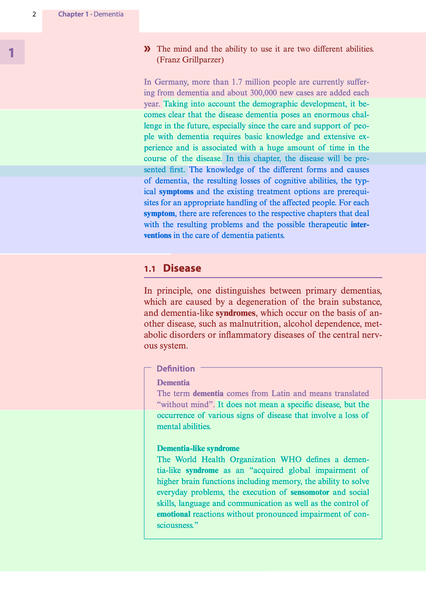
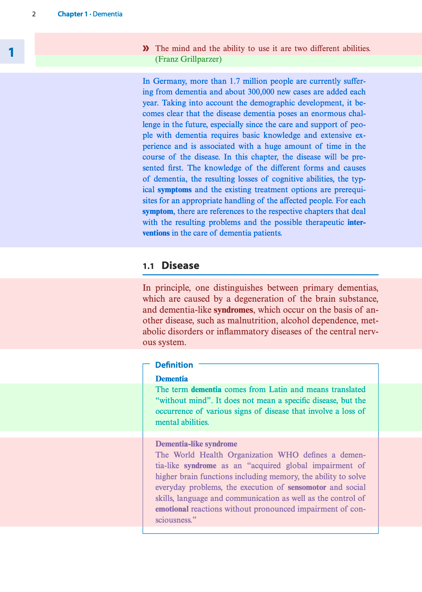

# Node Extractor

The goal is to find the best PDF Extractor

## Simple

Configured with

- `chunk_size = 128`
- `chunk_overlap = 20`

Result (extract):

```text
2 / ('dementia', 0.6027) / ('grillparzer', 0.2351) / ('franz', 0.1642) / ('different', 0.108) / ('added', 0.0096)
12 Chapter 1 · Dementia
» The mind and the ability to use it are two different abilities. 
(Franz Grillparzer)
In Germany, more than 1.7 million people are currently suffer -
ing from dementia and about 300,000 new cases are added each 
year.


3 / ('dementia', 0.6033) / ('peo', 0.3341) / ('sented', 0.0127) / ('especially', -0.0251) / ('basic', -0.0262)
Taking into account the demographic development, it be -
comes clear that the disease dementia poses an enormous chal -
lenge in the future, especially since the care and support of peo -
ple with dementia requires basic knowledge and extensive ex -
perience and is associated with a huge amount of time in the 
course of the disease. In this chapter, the disease will be pre -
sented first.


4 / ('dementia', 0.5934) / ('ical', 0.2788) / ('symptoms', 0.2697) / ('forms', 0.1235) / ('sented', 0.0821)
In this chapter, the disease will be pre -
sented first. The knowledge of the different forms and causes 
of dementia, the resulting losses of cognitive abilities, the typ -
ical symptoms  and the existing treatment options are prerequi -
sites for an appropriate handling of the affected people. For each 
symptom , there are references to the respective chapters that deal 
with the resulting problems and the possible therapeutic inter -
ventions  in the care of dementia patients.


5 / ('dementia', 0.6957) / ('malnutrition', 0.1456) / ('comes', 0.0177) / ('basis', -0.0295) / ('central', -0.0684)
1.1   Disease
In principle, one distinguishes between primary dementias, 
which are caused by a degeneration of the brain substance, 
and dementia-like syndromes , which occur on the basis of an -
other disease, such as malnutrition, alcohol dependence, met -
abolic disorders or inflammatory diseases of the central nerv -
ous system.
Definition
Dementia
The term dementia  comes from Latin and means translated 
“without mind”.


6 / ('dementia', 0.591) / ('defines', 0.1657) / ('sciousness', 0.0928) / ('reactions', 0.0151) / ('including', -0.0563)
It does not mean a specific disease, but the 
occurrence of various signs of disease that involve a loss of 
mental abilities.
Dementia-like syndrome
The World Health Organization WHO defines a demen -
tia-like syndrome  as an “acquired global impairment of 
higher brain functions including memory, the ability to solve 
everyday problems, the execution of sensomotor  and social 
skills, language and communication as well as the control of 
emotional  reactions without pronounced impairment of con -
sciousness.”
```

## Smart

Login in Github Container Registry

- create a token
- `export CR_PAT=THE_TOKEN`
- `echo $CR_PAT | docker login ghcr.io -u alros --password-stdin`

Download and start the docker image of nlm-ingestor

- `docker pull ghcr.io/nlmatics/nlm-ingestor:latest`

Result (extract):

```text
3 / ('dementia', 0.6419) / ('prognosis', 0.2913) / ('ability', 0.2849) / ('different', 0.1177) / ('contents', 0.1139)
Dementia > Contents > 1.1 Disease – 2 > 1.1.4 Prognosis – 12
The mind and the ability to use it are two different abilities.


4 / ('dementia', 0.6703) / ('grillparzer', 0.3538) / ('franz', 0.2914) / ('12', 0.113) / ('contents', 0.0881)
Dementia > Contents > 1.1 Disease – 2 > 1.1.4 Prognosis – 12
(Franz Grillparzer)


5 / ('dementia', 0.6626) / ('prerequisites', 0.0692) / ('added', 0.0388) / ('million', 0.0236) / ('especially', -0.0891)
Dementia > Contents > 1.1 Disease – 2 > 1.1.4 Prognosis – 12
In Germany, more than 1.7 million people are currently suffering from dementia and about 300,000 new cases are added each year.
Taking into account the demographic development, it becomes clear that the disease dementia poses an enormous challenge in the future, especially since the care and support of people with dementia requires basic knowledge and extensive experience and is associated with a huge amount of time in the course of the disease.
In this chapter, the disease will be presented first.
The knowledge of the different forms and causes of dementia, the resulting losses of cognitive abilities, the typical symptoms and the existing treatment options are prerequisites for an appropriate handling of the affected people.
For each symptom, there are references to the respective chapters that deal with the resulting problems and the possible therapeutic interventions in the care of dementia patients.


6 / ('dementia', 0.6222) / ('malnutrition', 0.2012) / ('principle', -0.0492) / ('basis', -0.0511) / ('central', -0.0756)
Dementia > Contents > 1.1 Disease – 2 > 1.1.4 Prognosis – 12 > 1.1 Disease
In principle, one distinguishes between primary dementias, which are caused by a degeneration of the brain substance, and dementia-like syndromes, which occur on the basis of another disease, such as malnutrition, alcohol dependence, metabolic disorders or inflammatory diseases of the central nervous system.


7 / ('dementia', 0.6424) / ('definition', 0.2936) / ('signs', 0.0248) / ('comes', 0.0243) / ('various', -0.0197)
Dementia > Contents > 1.1 Disease – 2 > 1.1.4 Prognosis – 12 > 1.1 Disease > Definition > Dementia
The term dementia comes from Latin and means translated “without mind”.
It does not mean a specific disease, but the occurrence of various signs of disease that involve a loss of mental abilities.


8 / ('dementia', 0.6517) / ('defines', 0.1592) / ('pronounced', 0.0414) / ('reactions', -0.0073) / ('including', -0.098)
Dementia > Contents > 1.1 Disease – 2 > 1.1.4 Prognosis – 12 > 1.1 Disease > Definition > Dementia
Dementia-like syndrome The World Health Organization WHO defines a dementia-like syndrome as an “acquired global impairment of higher brain functions including memory, the ability to solve everyday problems, the execution of sensomotor and social skills, language and communication as well as the control of emotional reactions without pronounced impairment of consciousness.”
```

## Comparison

Simple



Smart



The Simple extractor splits the text in paragraphs.

The Smart extractor follows quite precisely the layout and identifies the titles.
For example `1.1 Disease` is part of the first line in every chunk to identify the levels of the paragraphs. 
It is not perfect because last paragraph is identified as part of `Definition > Dementia` instead of `Definition > Dementia-like syndrome`.
