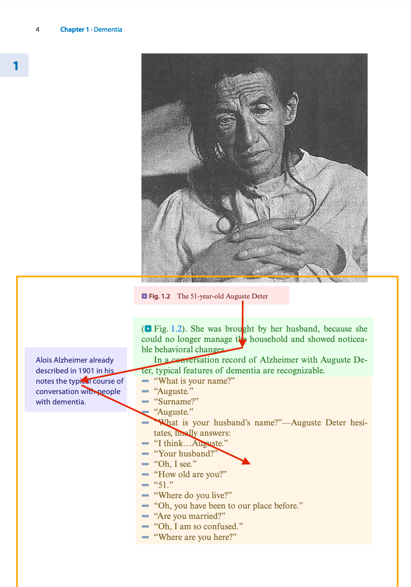
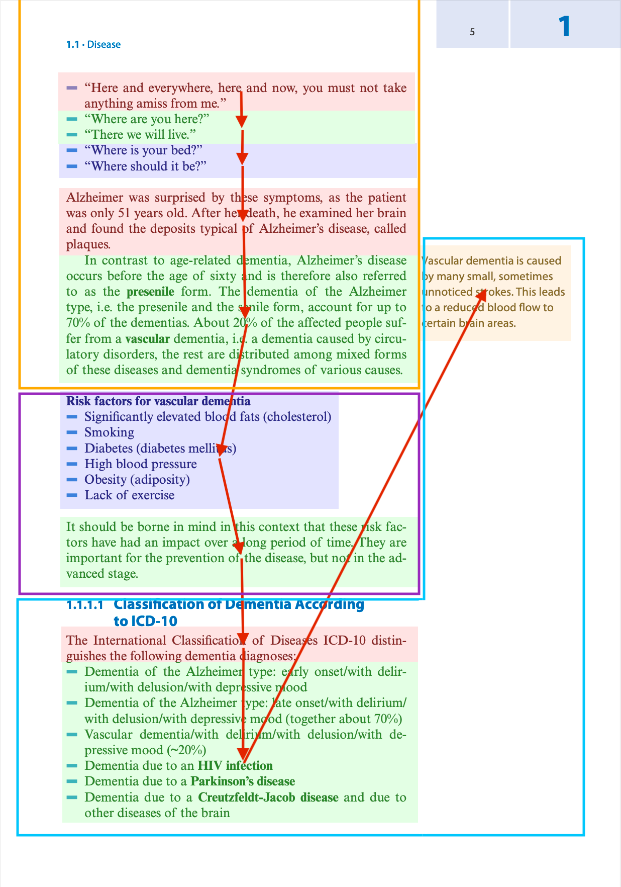

# Smarter Ingest

It combines `SimpleDirectoryReader`, `LayoutPDFReader`, and `KeyBERT` from previous experiments in a single reader

- [Background](#background)
- [Solution](#solution)
- [Setup](#setup)
- [Example of output](#example-of-output)
- [Problems](#problems)
  - [Observations](#observations)
- [Adding HeaderCleansing](#adding-headercleansing)
  - [Other tests](#other-tests)
- [Test](#test)

## Background

Approaches to PDF text extraction:

- Ramakrishnan, Cartic et al. “Layout-Aware Text Extraction from Full-Text PDF of Scientific Articles.” Source code for biology and medicine 7.1 (2012): 7–7. Web. [Link](https://www.ncbi.nlm.nih.gov/pmc/articles/PMC3441580/pdf/1751-0473-7-7.pdf).

Detection of continuous blocks of text, detection of multi-column layouts, classification and fusion of the extracted blocks.

- Bui, Duy Duc An, Guilherme Del Fiol, and Siddhartha Jonnalagadda. “PDF Text Classification to Leverage Information Extraction from Publication Reports.” Journal of biomedical informatics 61 (2016): 141–148. Web. [Link](https://www.sciencedirect.com/science/article/pii/S153204641630017X).

Strategy based on [PDFBox](https://pdfbox.apache.org/) and a classification algorithm to extract and categorise the content.

-   Gelbukh, Alexander. “Improved Text Extraction from PDF Documents for Large-Scale Natural Language Processing.” CICLing (1). Vol. 8403. Germany: Springer Berlin / Heidelberg, 2014. 102–112. Web. [Link](https://link-springer-com.uniessexlib.idm.oclc.org/content/pdf/10.1007/978-3-642-54906-9_9).

Based on [pdfXtk](https://github.com/tamirhassan/pdfxtk/) (built on top of PDFBox), [Apache Tika](https://tika.apache.org/) and [Poppler](https://poppler.freedesktop.org/) (based on [XpdfReader](http://www.xpdfreader.com/)).

## Solution

[LLM Sherpa](https://github.com/nlmatics/llmsherpa): a python library to use [NLM-Ingestor](https://github.com/nlmatics/nlm-ingestor) based on [NLM-Tika](https://github.com/nlmatics/nlm-tika) part of Apache Tika.

## Setup

Login in Github Container Registry

- create a token
- `export CR_PAT=THE_TOKEN`
- `echo $CR_PAT | docker login ghcr.io -u alros --password-stdin`

Download and start the docker image of nlm-ingestor

`docker pull ghcr.io/nlmatics/nlm-ingestor:latest`

Run `SmarterExtractor.py`

## Example of output

```text
================================
chunk 5
Dementia > Contents > 1.1 Disease – 2 > 1.1.4 Prognosis – 12
(dementia, 0.669) / (resulting, 0.0783) / (prerequisites, 0.059) / (added, 0.039) / (especially, -0.0821)
--------------------------------
In Germany, more than 1.7 million people are currently suffering from dementia and about 300,000 new cases are added each year.
Taking into account the demographic development, it becomes clear that the disease dementia poses an enormous challenge in the future, especially since the care and support of people with dementia requires basic knowledge and extensive experience and is associated with a huge amount of time in the course of the disease.
In this chapter, the disease will be presented first.
The knowledge of the different forms and causes of dementia, the resulting losses of cognitive abilities, the typical symptoms and the existing treatment options are prerequisites for an appropriate handling of the affected people.
For each symptom, there are references to the respective chapters that deal with the resulting problems and the possible therapeutic interventions in the care of dementia patients.

================================
chunk 6
Dementia > Contents > 1.1 Disease – 2 > 1.1.4 Prognosis – 12 > 1.1 Disease
(dementia, 0.616) / (malnutrition, 0.2544) / (basis, 0.0078) / (principle, -0.0106) / (central, -0.0361)
--------------------------------
In principle, one distinguishes between primary dementias, which are caused by a degeneration of the brain substance, and dementia-like syndromes, which occur on the basis of another disease, such as malnutrition, alcohol dependence, metabolic disorders or inflammatory diseases of the central nervous system.

================================
chunk 7
Dementia > Contents > 1.1 Disease – 2 > 1.1.4 Prognosis – 12 > 1.1 Disease > Definition > Dementia
(dementia, 0.7149) / (latin, 0.2621) / (signs, 0.079) / (comes, 0.0451) / (specific, -0.0012)
--------------------------------
The term dementia comes from Latin and means translated “without mind”.
It does not mean a specific disease, but the occurrence of various signs of disease that involve a loss of mental abilities.

================================
chunk 8
Dementia > Contents > 1.1 Disease – 2 > 1.1.4 Prognosis – 12 > 1.1 Disease > Definition > Dementia
(dementia, 0.7248) / (defines, 0.1603) / (pronounced, 0.1049) / (reactions, 0.0226) / (including, -0.0648)
--------------------------------
Dementia-like syndrome The World Health Organization WHO defines a dementia-like syndrome as an “acquired global impairment of higher brain functions including memory, the ability to solve everyday problems, the execution of sensomotor and social skills, language and communication as well as the control of emotional reactions without pronounced impairment of consciousness.”
```

Each block contains
- The position of the paragraph.
- The keywords extracted from the text.
- The text of a paragraph without overlapping.

---

## Problems

```text
================================
chunk 10
Dementia > 1.1.1 Forms of Dementia > . Fig. 1.1 Alois Alzheimer
(auguste, 0.5416) / (51, 0.3419) / (deter, 0.3369) / (old, 0.3045) / (fig, 0.1756)
--------------------------------
Fig. 1.2 The 51-year-old Auguste Deter

================================
chunk 11
Dementia > 1.1.1 Forms of Dementia > . Fig. 1.1 Alois Alzheimer
(dementia, 0.558) / (auguste, 0.2756) / (deter, 0.2242) / (brought, 0.1211) / (typical, 0.0615)
--------------------------------
(. Fig. 1.2).
She was brought by her husband, because she could no longer manage the household and showed noticeable behavioral changes.
In a conversation record of Alzheimer with Auguste Deter, typical features of dementia are recognizable.

================================
chunk 12
Dementia > 1.1.1 Forms of Dementia > . Fig. 1.1 Alois Alzheimer
(alzheimer, 0.5562) / (alois, 0.3717) / (1901, 0.3332) / (conversation, 0.2865) / (typical, 0.0538)
--------------------------------
Alois Alzheimer already described in 1901 in his notes the typical course of conversation with people with dementia.

================================
chunk 13
Dementia > 1.1.1 Forms of Dementia > . Fig. 1.1 Alois Alzheimer
(auguste, 0.4655) / (surname, 0.254) / (hesitates, 0.2441) / (51, 0.2147) / (finally, 0.0531)
--------------------------------
5 “What is your name?”
5 “Auguste.”
5 “Surname?”
5 “Auguste.”
5 “What is your husband’s name?
”—Auguste Deter hesitates, finally answers: 5 “I think…Auguste.”
5 “Your husband?”
5 “Oh, I see.”
5 “How old are you?”
5 “51.”
5 “Where do you live?”
5 “Oh, you have been to our place before.”
5 “Are you married?”
5 “Oh, I am so confused.”
5 “Where are you here?”

================================
chunk 14
Dementia > 1.1.1 Forms of Dementia > . Fig. 1.1 Alois Alzheimer
(amiss, 0.3641)
--------------------------------
“Here and everywhere, here and now, you must not take anything amiss from me.”

================================
chunk 15
Dementia > 1.1.1 Forms of Dementia > . Fig. 1.1 Alois Alzheimer
(live, 0.3419)
--------------------------------
5 “Where are you here?”
5 “There we will live.”

================================
chunk 16
Dementia > 1.1.1 Forms of Dementia > . Fig. 1.1 Alois Alzheimer
(bed, 0.5281)
--------------------------------
5 “Where is your bed?”
5 “Where should it be?”

================================
chunk 17
Dementia > 1.1.1 Forms of Dementia > . Fig. 1.1 Alois Alzheimer
(alzheimer, 0.6719) / (symptoms, 0.2545) / (deposits, 0.2171) / (examined, 0.1414) / (surprised, 0.0761)
--------------------------------
Alzheimer was surprised by these symptoms, as the patient was only 51 years old.
After her death, he examined her brain and found the deposits typical of Alzheimer’s disease, called plaques.

================================
chunk 18
Dementia > 1.1.1 Forms of Dementia > . Fig. 1.1 Alois Alzheimer
(dementia, 0.5356) / (vascular, 0.2692) / (forms, 0.1361) / (senile, 0.1251) / (distributed, 0.0685)
--------------------------------
In contrast to age-related dementia, Alzheimer’s disease occurs before the age of sixty and is therefore also referred to as the presenile form.
The dementia of the Alzheimer type, i.e.
the presenile and the senile form, account for up to 70% of the dementias.
About 20% of the affected people suffer from a vascular dementia, i.e.
a dementia caused by circulatory disorders, the rest are distributed among mixed forms of these diseases and dementia syndromes of various causes.

================================
chunk 19
Dementia > Risk factors for vascular dementia
(obesity, 0.4494) / (elevated, 0.2532) / (pressure, 0.0816) / (significantly, 0.0814) / (mellitus, 0.0125)
--------------------------------
5 Significantly elevated blood fats (cholesterol) 5 Smoking 5 Diabetes (diabetes mellitus) 5 High blood pressure 5 Obesity (adiposity) 5 Lack of exercise

================================
chunk 20
Dementia > Risk factors for vascular dementia
(prevention, 0.5121) / (factors, 0.313) / (advanced, 0.1599) / (borne, 0.0376) / (time, 0.035)
--------------------------------
It should be borne in mind in this context that these risk factors have had an impact over a long period of time.
They are important for the prevention of the disease, but not in the advanced stage.

================================
chunk 21
Dementia > 1.1.1.1 Classification of Dementia According to ICD-10
(dementia, 0.6141) / (10, 0.1594) / (distinguishes, 0.1512) / (international, 0.1174) / (following, 0.0617)
--------------------------------
The International Classification of Diseases ICD-10 distinguishes the following dementia diagnoses:

================================
chunk 22
Dementia > 1.1.1.1 Classification of Dementia According to ICD-10
(dementia, 0.6172) / (delusion, 0.2268) / (creutzfeldt, 0.1286) / (vascular, 0.0276) / (early, -0.0157)
--------------------------------
5 Dementia of the Alzheimer type: early onset/with delirium/with delusion/with depressive mood 5 Dementia of the Alzheimer type: late onset/with delirium/ with delusion/with depressive mood (together about 70%) 5 Vascular dementia/with delirium/with delusion/with depressive mood (~20%) 5 Dementia due to an HIV infection 5 Dementia due to a Parkinson’s disease 5 Dementia due to a Creutzfeldt-Jacob disease and due to other diseases of the brain

================================
chunk 23
Dementia > 1.1.1.1 Classification of Dementia According to ICD-10
(dementia, 0.6081) / (vascular, 0.4767) / (areas, 0.1475) / (leads, 0.0837) / (reduced, 0.0297)
--------------------------------
Vascular dementia is caused by many small, sometimes unnoticed strokes.
This leads to a reduced blood flow to certain brain areas.
```

Compare with the page





- The coloured rectangles identify the chunks.
- The red arrows indicate the flow of the chunks.
- The coloured rectangles identify the areas with the same header.

### Observations

- The dialog is split in 4 chunks.
- The title of the orange rectangle if `Dementia > 1.1.1 Forms of Dementia > . Fig. 1.1 Alois Alzheimer`.
- The order of the chunks at the sides of the page is inconsistent.

## Adding HeaderCleansing

HeaderCleansing successfully integrates part of the missing information in the headers in the test case.

Comparison (before / after)

Removal of extra blocks at the beginning and the end
- Dementia > Contents > 1.1 Disease – 2 > 1.1.4 Prognosis – 12
- Disease > 1.1.4 Prognosis

Removal of repetitions
- Dementia > Contents > 1.1 Disease – 2 > 1.1.4 Prognosis – 12 > 1.1 Disease
- 1.1 Disease > 1.1.4 Prognosis

Stateful processing with integration of the missing blocks at the beginning
- Dementia > 1.1.1 Forms of Dementia
- 1.1 Disease > 1.1.1 Forms of Dementia

Stateful processing with integration of the missing blocks in the middle
- Dementia > 1.1.1.1 Classification of Dementia According to ICD-10
- 1.1 Disease > 1.1.1 Forms of Dementia > 1.1.1.1 Classification of Dementia According to ICD-10

Removal of invalid blocks
- Dementia > 1.1.1 Forms of Dementia > . Fig. 1.1 Alois Alzheimer
- 1.1 Disease > 1.1.1 Forms of Dementia

Remaining or new issues:
- Removal of potentially useful blocks
- Not all blocks can be integrated

E.g.
- Dementia > 1.1.1.2 Severity Levels > Warning signs
- 1.1 Disease > 1.1.1.2 Severity Levels

or
- Dementia > 1.1.5.4 Complications > Delirium
- 1.1 Disease > 1.1.5 Treatment > 1.1.5.4 Complications

### Other tests

With a different text with a simpler structure, the parsing is successful.

## Test

Tested with
- Simone Schmidt, Martina Döbele - Dementia Companion - chapter1
- Lisa D. Ravdin, Heather L. Katzen - Handbook on the Neuropsychology of Aging and Dementia - chapter 1